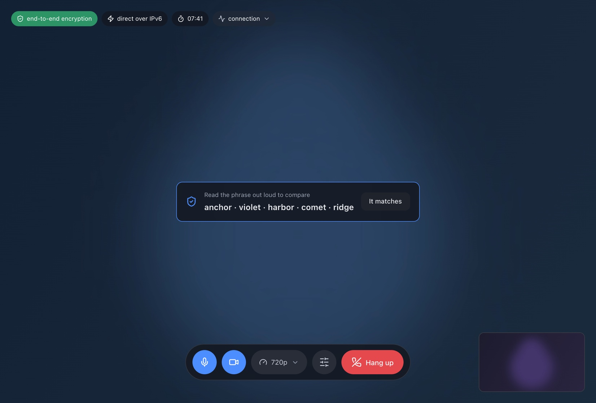
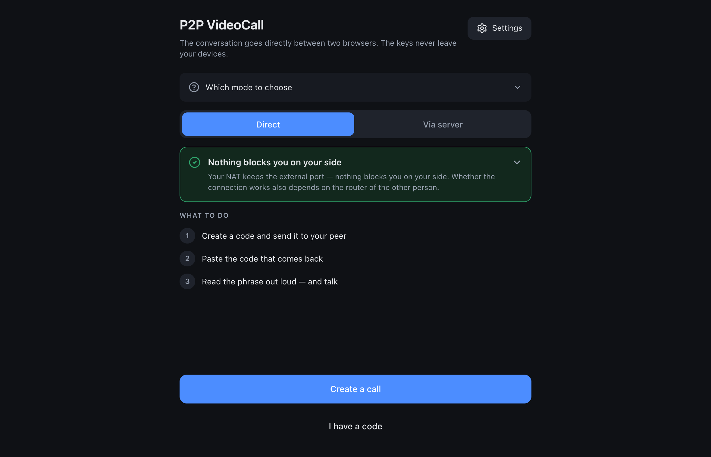
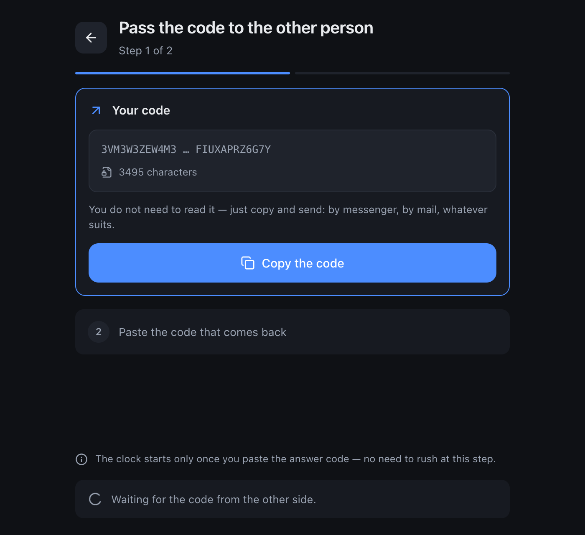
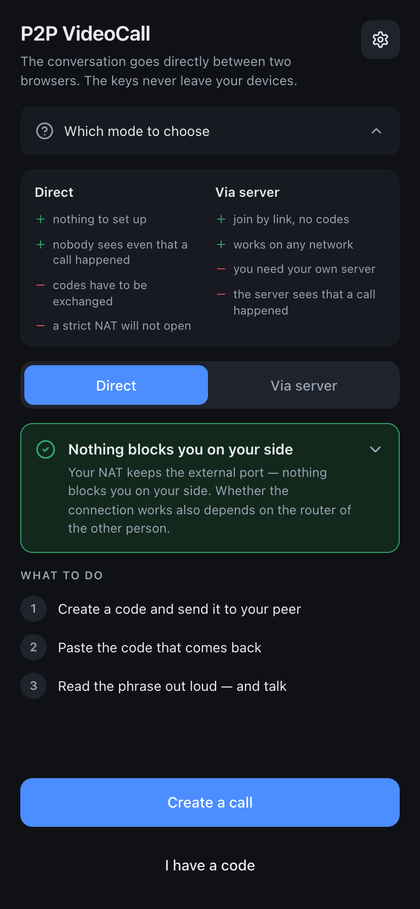
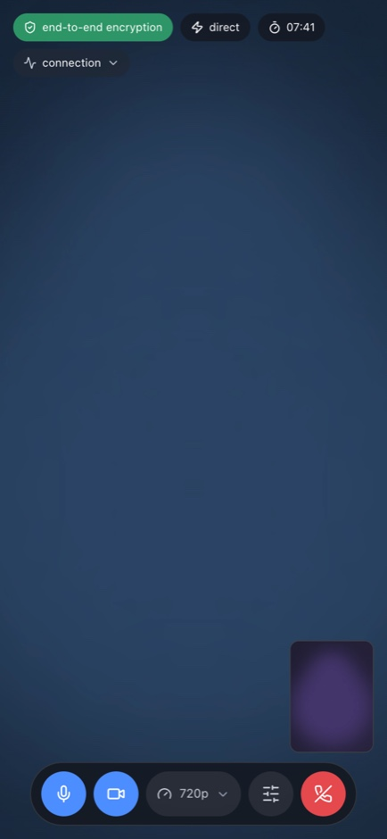
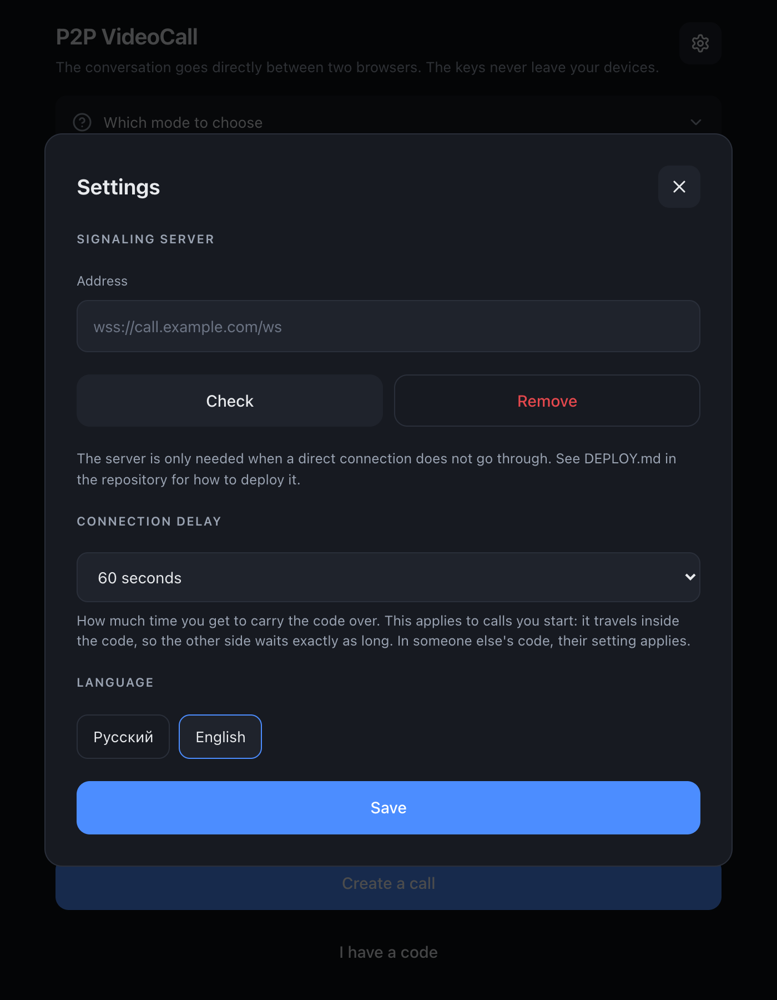

# P2P VideoCall

[Русский](README.md) · **English**

A two-person video call that goes straight between browsers, with end-to-end
encrypted media frames. The page is plain static hosting on GitHub Pages, and by
default there is no server at all: no accounts, no database, no call history.

<p align="center">
  
</p>

- **Demo** — https://afrunz.github.io/P2P-VideoCall/
- **Your own server** (not everyone needs one) — [DEPLOY.md](DEPLOY.md)
- **Specification** (Russian) — [TZ.md](TZ.md)

## Two modes

<table>
<tr><td width="50%" valign="top">

**Direct — no server whatsoever**

The two sides exchange connection codes: one creates a code and sends it over
any messenger, the other pastes it and sends the answer back. From there the
connection is direct. Nobody — including the author of this app — even knows the
call happened.

</td><td width="50%" valign="top">

**Via your own server — by link**

For when a direct connection does not go through: symmetric NAT on mobile
carriers, corporate networks with UDP cut off. Joining becomes a single link, no
code exchange. The room secret lives after the `#` and never reaches the server,
so all it sees is opaque blobs.

</td></tr>
</table>

Before suggesting a server, the app honestly tries to do without one: IPv6, the
local network, hole punching through several STUN servers, automatic ICE
restart. NAT type is probed up front, so the warning arrives before you send a
code for nothing.

<p align="center">
  
  
</p>

## Encryption

Two layers, both always on — there is deliberately no switch.

1. **DTLS-SRTP** — built into WebRTC, cannot be turned off. Keys via ECDHE
   P-256. In the serverless mode the certificate fingerprint travels hand to
   hand rather than through a middleman, so this layer alone is genuine E2EE.
2. **Frame encryption** — AES-256-GCM in a dedicated worker, on top of the
   transport layer. Keys are derived with ECDH P-256 + HKDF and never leave the
   browsers. This is the layer that shuts out the relay: even if media goes over
   TURN, the server only ever sees ciphertext.

On top of that there is a **verification phrase** of five words, derived from the
shared secret and both DTLS fingerprints. Matching phrases mean nobody sits in
the middle; reading them out loud takes ten seconds.

The badge during a call shows what is actually in effect and expands into an
explanation — "the network can't hear you" and "the server can't hear you" as
separate points. If the browser lacks Encoded Transform, the app does not
pretend: the badge honestly drops to transport-only encryption.

## What else is in there

- **Rejoining.** Closing or reloading a tab does not end the call for the other
  side: they wait in the room and carry on from where they were. Only an
  explicit "Hang up" ends the conversation.
- **A waiting room** in link mode: arrive first, check your camera and sound,
  the other side joins on their own.
- **Settings inside the call** — camera, microphone, resolution
  (360p/720p/1080p), frame rate (30/60) and a low-latency mode. Switching
  cameras shows up immediately, with no reconnect.
- **The connection route** is visible in a badge: local network, direct over
  IPv6, through NAT, or through a relay.
- **Statistics** (bitrate, loss, RTT, resolution) — behind a button, so they
  stay out of the way.
- **Calls without a camera or microphone.** You can join just to watch and
  listen; if only half the devices are available, that half works.
- **Russian and English**, detected from the browser and switchable in settings.
- **Installable as an app** (PWA) — on a phone the call keeps running while the
  tab is in the background.

<p align="center">
  
  
  
</p>

## Development

```bash
npm install
npm run dev        # dev server
npm test           # 464 tests
npm run typecheck
npm run build      # typecheck and build into dist/
```

The logic lives in pure modules that never touch the DOM — those are what the
tests cover. The browser-facing part (`RTCPeerConnection`, the worker,
`getUserMedia`) is deliberately thin.

```
src/
  signaling/   connection codes, SDP parsing, invite links, signaling client
  crypto/      ECDH and HKDF, frame layout, key generations, SAS, encryption worker
  net/         NAT diagnostics, reachability checks, ICE configuration
  call/        call orchestrator, media, statistics, encoded transform
  media/       quality and bitrate presets
  protocol/    control channel and signaling protocol (shared with the server)
  i18n/        ru/en dictionaries
  ui/          icons, formatting, DOM helpers
server/        signaling server, deployed with Docker
```

There is exactly one runtime dependency — an icon set. No framework, no build
magic: TypeScript, Vite, Vitest.

## Publishing on GitHub Pages

The app is static, so Pages is enough. Assets are built with relative paths, so
the repository can be named anything and nothing needs editing.

```bash
git remote add origin git@github.com:<user>/<repo>.git
git push -u origin main
```

Then, once, in the repository settings: **Settings → Pages → Build and
deployment → Source: GitHub Actions**. Specifically `GitHub Actions`, not
`Deploy from a branch` — otherwise the workflow runs but the result goes
nowhere.

After that every push to `main` runs `.github/workflows/deploy.yml`: typecheck,
tests and a server build first, and only if everything is green — publish. The
site appears at `https://<user>.github.io/<repo>/`.

Things worth knowing about Pages:

- **HTTPS is mandatory** — without it the browser will not hand over the camera.
  Pages provides it.
- **The invite link** carries the room secret after `#`, and a URL fragment is
  never sent to the server. Pages serves static files and learns nothing about
  what is in the links.
- **A signaling server cannot run on Pages** — it is static hosting. If you need
  one, deploy it separately ([DEPLOY.md](DEPLOY.md), in Russian); its address is
  entered in the app settings and stored only in the browser.

## Limitations

- Exactly two participants: manual signaling does not allow for more.
- Without your own server roughly 10–20% of connections will not establish —
  that is a property of NAT, not of the app.
- End-to-end frame encryption requires Encoded Transform support
  (`RTCRtpScriptTransform`, or the legacy `createEncodedStreams`). Without it
  the call falls back to transport encryption, and the interface says so.
- In the serverless mode the connection code has to be carried by hand, within a
  time limit — one minute by default, adjustable in settings.

## License

[MIT](LICENSE).
