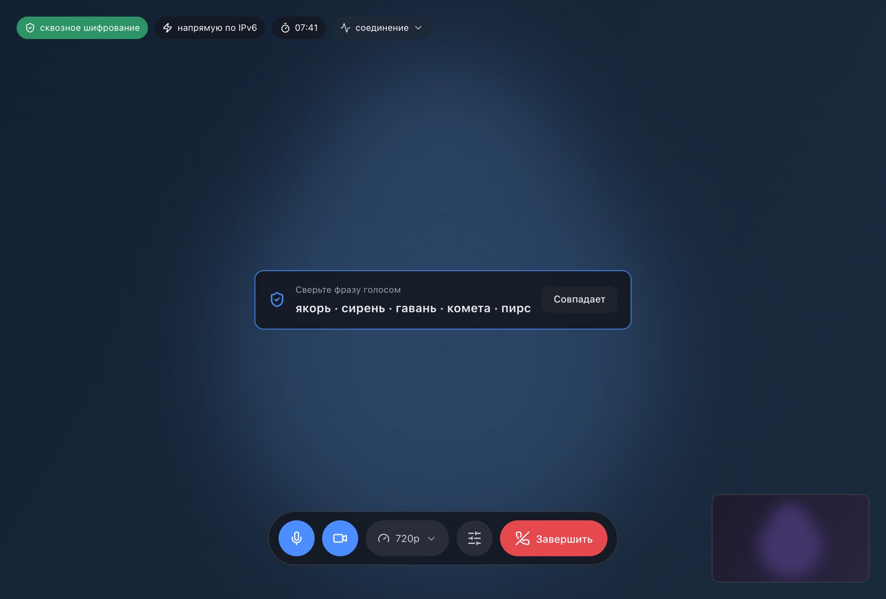
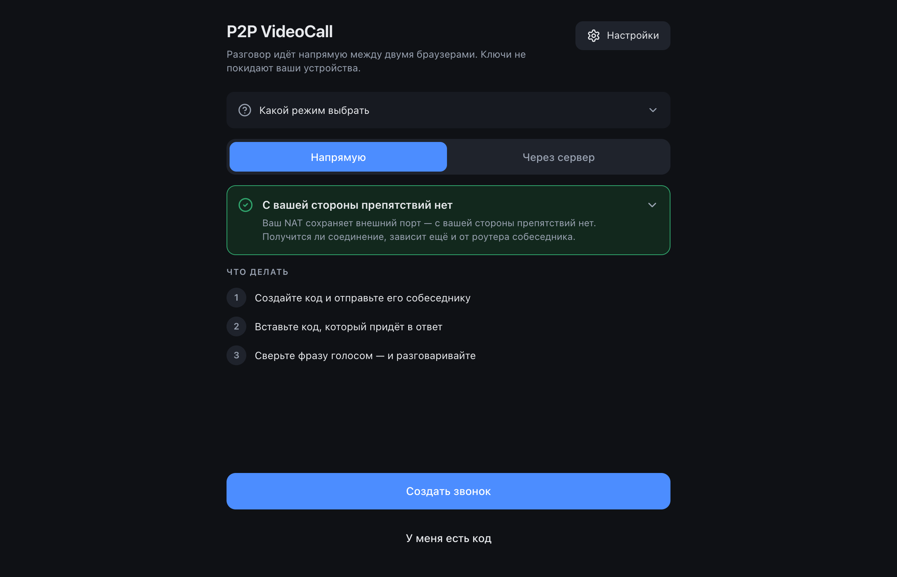
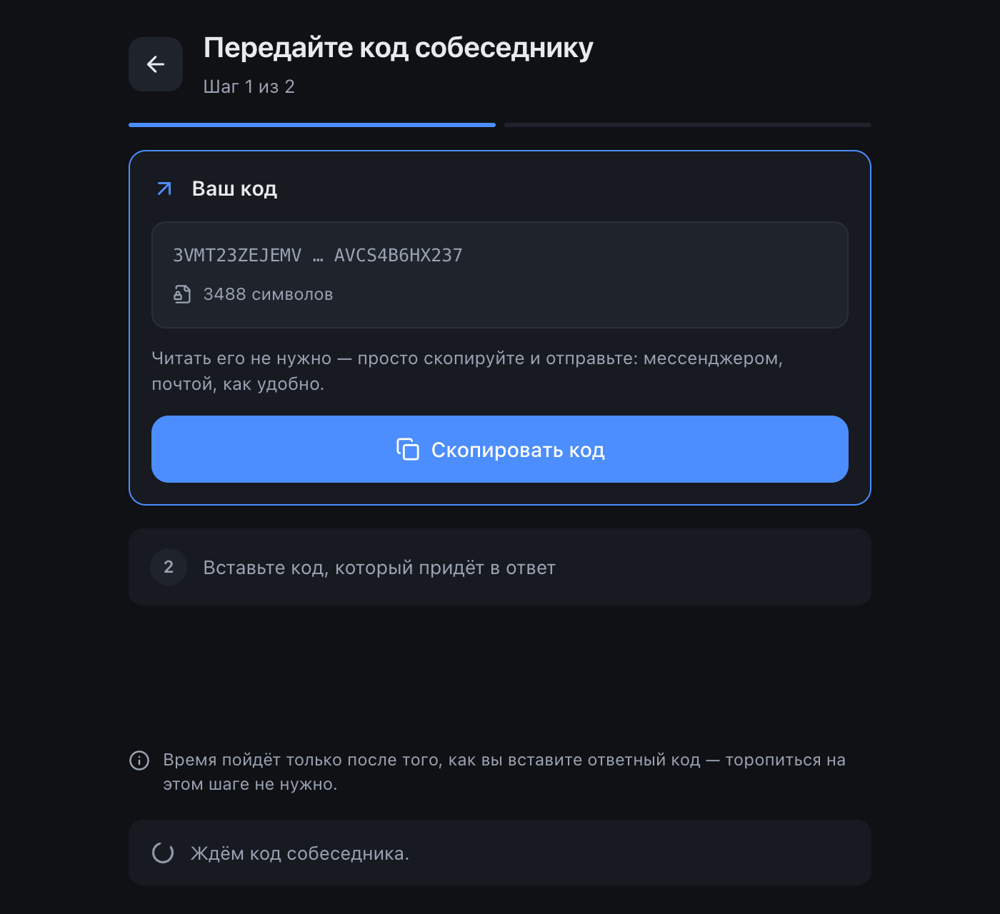
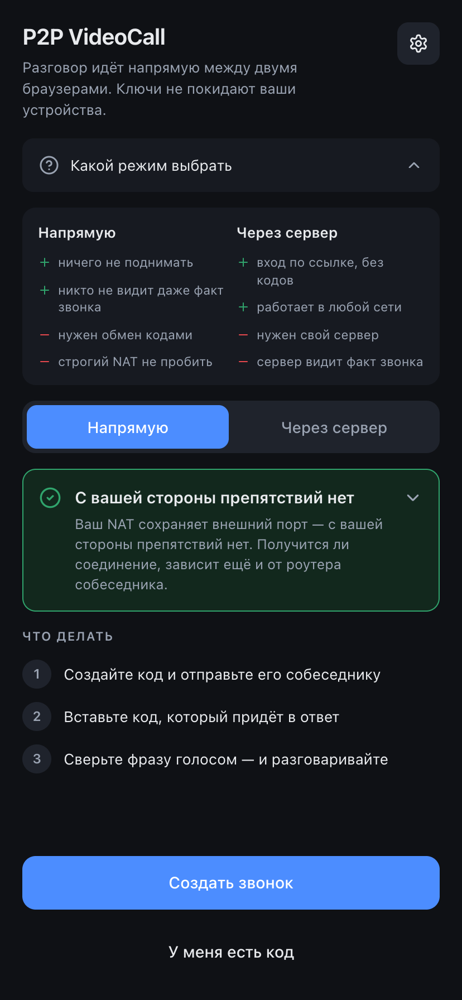
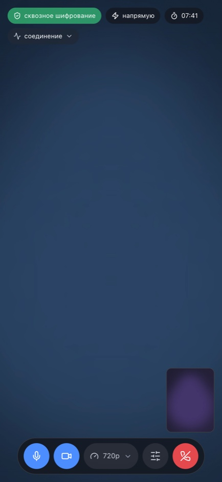
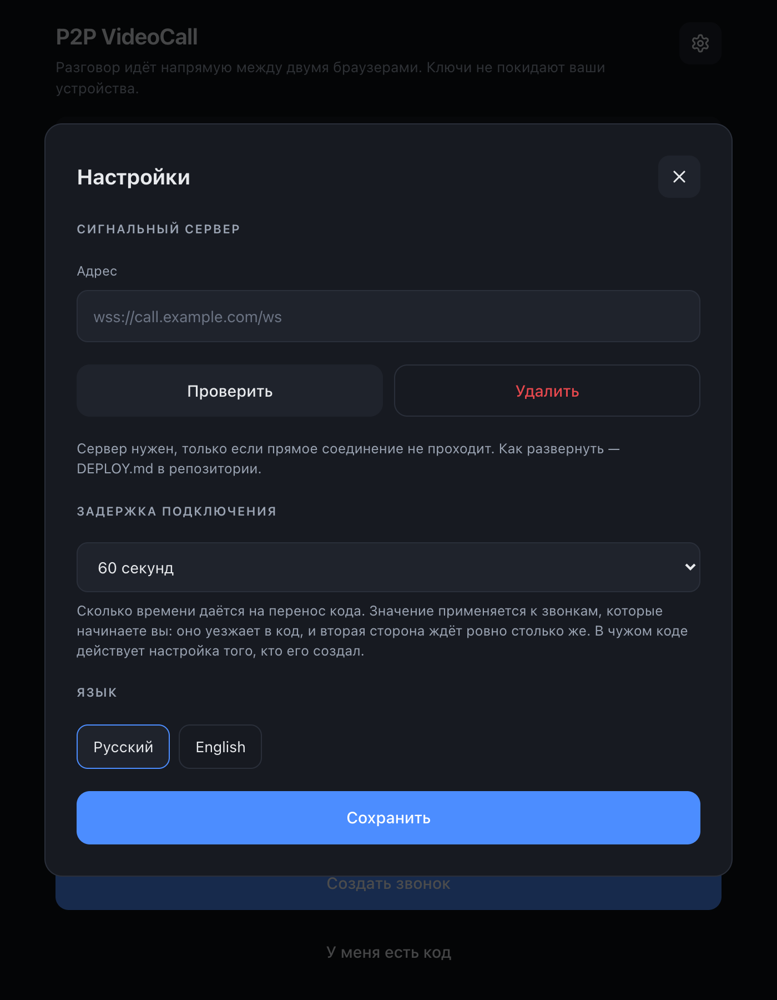

# P2P VideoCall

**Русский** · [English](README.en.md)

Видеозвонок на двоих напрямую между браузерами, со сквозным шифрованием кадров.
Страница — обычная статика на GitHub Pages, сервера по умолчанию нет вообще:
ни аккаунтов, ни базы, ни истории звонков.

<p align="center">
  
</p>

- **Демо** — https://afrunz.github.io/p2p-call/
- **Свой сервер** (нужен не всем) — [DEPLOY.md](DEPLOY.md)
- **Техническое задание** — [TZ.md](TZ.md)

## Два режима

<table>
<tr><td width="50%" valign="top">

**Напрямую — без всякого сервера**

Участники обмениваются кодами подключения: один создаёт код и присылает его
любым мессенджером, второй вставляет и отправляет ответный. Дальше соединение
идёт напрямую. Никто, включая автора приложения, не знает даже о самом факте
звонка.

</td><td width="50%" valign="top">

**Через свой сервер — по ссылке**

Нужен, когда прямое соединение не проходит: symmetric NAT у мобильных
операторов, корпоративные сети с зарезанным UDP. Подключение становится по
ссылке, обмен кодами не нужен. Секрет комнаты лежит после `#` и на сервер не
попадает — он видит только непрозрачные блобы.

</td></tr>
</table>

Прежде чем предлагать сервер, приложение честно пытается обойтись без него:
IPv6, локальная сеть, hole punching через несколько STUN, автоматический ICE
restart. Тип NAT определяется заранее — предупреждение приходит до того, как вы
впустую перешлёте код.

<p align="center">
  
  
</p>

## Шифрование

Два слоя, оба всегда включены — переключателя намеренно нет.

1. **DTLS-SRTP** — встроен в WebRTC, отключить нельзя. Ключи через ECDHE P-256.
   В режиме без сервера отпечаток сертификата едет из рук в руки, а не через
   посредника, поэтому уже этот слой даёт настоящий E2EE.
2. **Шифрование кадров** — AES-256-GCM в отдельном воркере, поверх
   транспортного. Ключи выводятся через ECDH P-256 + HKDF и не покидают
   браузеры. Именно этот слой закрывает ретранслятор: даже если медиа пойдёт
   через TURN, сервер увидит шифротекст.

Сверх этого — **контрольная фраза** из пяти слов, выведенная из общего секрета
и обоих DTLS-отпечатков. Одинаковая фраза у обоих означает, что посередине
никого нет; сверяется голосом, за десять секунд.

Бейдж в звонке показывает, что именно работает прямо сейчас, и разворачивается
в пояснение: «сеть не слышит» и «сервер не слышит» — отдельными пунктами. Если
браузер не умеет Encoded Transform, приложение не притворяется: бейдж честно
опускается до транспортного шифрования.

## Что ещё есть

- **Возврат в разговор.** Закрытая или перезагруженная вкладка не рвёт звонок
  собеседнику: он ждёт в комнате и продолжает с того же места. Разговор
  заканчивается только явным «Завершить».
- **Комната ожидания** в режиме ссылки: пришли первым — проверьте камеру и звук,
  собеседник подключится сам.
- **Настройки прямо в звонке** — камера, микрофон, разрешение (360p/720p/1080p),
  частота кадров (30/60) и режим минимальной задержки. Смена камеры видна сразу,
  переподключаться не нужно.
- **Маршрут соединения** видно в бейдже: локальная сеть, напрямую по IPv6, через
  NAT или через ретранслятор.
- **Статистика** (битрейт, потери, RTT, разрешение) — под кнопкой, чтобы не
  мозолила глаза.
- **Звонок без камеры и микрофона.** Можно войти только смотреть и слушать; если
  доступна половина устройств — работает половина.
- **Русский и английский**, определяется по браузеру и переключается в настройках.
- **Устанавливается как приложение** (PWA) — на телефоне звонок продолжается,
  когда вкладка свёрнута.

<p align="center">
  
  
  
</p>

## Разработка

```bash
npm install
npm run dev        # локальный сервер разработки
npm test           # 464 теста
npm run typecheck
npm run build      # тайпчек и сборка в dist/
```

Логика вынесена в чистые модули без обращений к DOM — именно они покрыты
тестами. Браузерная часть (`RTCPeerConnection`, воркер, `getUserMedia`)
намеренно тонкая.

```
src/
  signaling/   коды подключения, разбор SDP, ссылки-приглашения, клиент сигналинга
  crypto/      ECDH и HKDF, раскладка кадров, поколения ключей, SAS, воркер шифрования
  net/         диагностика NAT, проверки достижимости, конфигурация ICE
  call/        оркестратор звонка, медиа, статистика, encoded transform
  media/       пресеты качества и битрейтов
  protocol/    контрольный канал и протокол сигналинга (общий с сервером)
  i18n/        словари ru/en
  ui/          иконки, форматирование, работа с DOM
server/        сигнальный сервер, разворачивается через Docker
```

Зависимостей в рантайме ровно одна — набор иконок. Ни фреймворка, ни сборочной
магии: TypeScript, Vite, Vitest.

## Публикация на GitHub Pages

Приложение — статика, поэтому Pages ему достаточно. Ассеты собираются с
относительными путями, так что имя репозитория может быть любым и ничего
править не нужно.

```bash
git remote add origin git@github.com:<логин>/<репозиторий>.git
git push -u origin main
```

Дальше один раз в настройках репозитория: **Settings → Pages → Build and
deployment → Source: GitHub Actions**. Именно `GitHub Actions`, а не
`Deploy from a branch` — иначе воркфлоу отработает, но результат никуда не
попадёт.

После этого каждый push в `main` запускает `.github/workflows/deploy.yml`:
сначала тайпчек, тесты и сборка сервера, и только если всё зелёное —
публикация. Сайт появится по адресу `https://<логин>.github.io/<репозиторий>/`.

Что важно знать про Pages:

- **HTTPS обязателен** — без него браузер не отдаст камеру. Pages даёт его сам.
- **Ссылка-приглашение** содержит секрет комнаты после `#`, а фрагмент URL не
  отправляется на сервер. Pages раздаёт статику и о содержимом ссылок ничего не
  узнаёт.
- **Сигнальный сервер на Pages не поднять** — это статический хостинг. Если он
  понадобится, разворачивайте отдельно ([DEPLOY.md](DEPLOY.md)); адрес
  указывается в настройках приложения и хранится только в браузере.

## Ограничения

- Ровно два участника: ручной сигналинг большего не позволяет.
- Без своего сервера примерно 10–20% соединений не установятся — это свойство
  NAT, а не приложения.
- Сквозное шифрование кадров требует поддержки Encoded Transform
  (`RTCRtpScriptTransform` или устаревший `createEncodedStreams`). Без неё
  звонок работает на транспортном шифровании, о чём в интерфейсе висит
  предупреждение.
- В режиме без сервера код подключения приходится переносить руками, и делать
  это надо в отведённое время — по умолчанию минута, меняется в настройках.

## Лицензия

[MIT](LICENSE).
